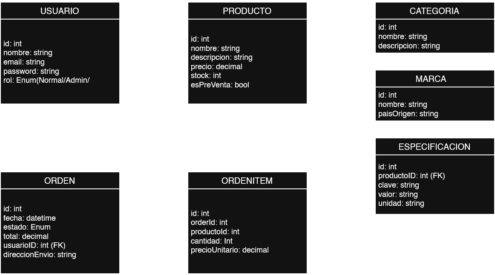

# 🛠️ Sistema de Gestión Hardware Store

Proyecto Integrador — Tecnologias de Desarrollo de Software IDE

## 👥 Integrantes

| Nombre | Legajo | Email |
|---|---|---|
| [Gil Agustin] | [50412] | [agussv360@gmail.com] |
| [Fiorini Mauricio] | [50475] | [mauriciofiorini911@gmail.com] |
| [Herrera Nicolas] | [51541] | [herreranico2703@gmail.com] |

---

## 📋 Descripción

El sistema consiste en el desarrollo de una plataforma de e-commerce especializada en hardware para computadoras, que combina la venta al público con la gestión interna del negocio (clientes, productos y órdenes de compra). Desde el lado del cliente, los usuarios pueden navegar el catálogo mediante búsqueda y filtros por categoría, marca, precio y compatibilidad, con tres niveles de acceso diferenciados: usuario normal (navegación y compra) y administrador (gestión completa del catálogo, clientes y órdenes).

A nivel de arquitectura, el backend está desarrollado en .NET y expone una API REST con autenticación basada en tokens JWT, consumida por dos frontends distintos: una aplicación de escritorio (Windows Forms) y una interfaz web (Blazor), lo que permite validar el mismo modelo de negocio bajo dos paradigmas de UI diferentes. Para el acceso a datos se adoptó un enfoque híbrido: ADO.NET para las operaciones críticas en términos de rendimiento —como las búsquedas con filtros complejos, donde el control fino sobre las consultas SQL resulta necesario—, y Entity Framework para el resto de las operaciones CRUD, priorizando productividad y mantenibilidad del código. El proyecto integra así los conceptos de arquitectura en capas, persistencia de datos y buenas prácticas de programación vistos a lo largo de la materia.

## ⚙️ Funcionalidades principales

- 🧑‍💼 **Gestión de clientes**: alta, baja, modificación y consulta de clientes.
- 📦 **Gestión de productos**: catálogo de productos con stock, precio y categoría.
- 🧾 **Gestión de órdenes**: creación de órdenes de compra asociadas a clientes, con el detalle de productos y cantidades.
- 📊 **Reportes**: Reportes de Clientes, Productos vendidos, productos filtrados por marca, etc.

## 💻 Tecnologías utilizadas

- **Lenguaje**: C#
- **Framework**: .NET 8.0
- **Acceso a datos**: Entity Framework Core - ADO.NET
- **Base de datos**: SQL Server
- **Interfaz**: Blazor

## 🏗️ Arquitectura del proyecto

El sistema está organizado en capas:

- **Capa de Presentación**: interfaz de usuario.
- **Capa de Lógica de Negocio**: reglas y validaciones del dominio.
- **Capa de Acceso a Datos**: repositorios y contexto de EF Core.
- **Capa de Entidades**: modelos de dominio (Cliente, Producto, Orden, DetalleOrden, etc.)

## 🗂️ Diagrama de clases

<!-- Insertar aquí la imagen del diagrama de clases -->


## 📁 Estructura del repositorio

```
IDE-TPI
├── docs/
│   ├── conversaciones-ia/
│   └── DDC.png
├── TPI-EnMemoria/
│   ├── [Proyecto].Domain/
│   ├── [Proyecto].DataAccess/
│   ├── [Proyecto].BusinessLogic/
│   └── [Proyecto].Presentation/
├── TPI-Completo/
│   ├── [Proyecto].Domain/
│   ├── [Proyecto].DataAccess/
│   ├── [Proyecto].BusinessLogic/
│   ├── [Proyecto].WindowsForms/
│   ├── [Proyecto].Blazor/
│   └── [Proyecto].Database/
└── README.md
```

## 📄 Licencia

Proyecto académico desarrollado con fines educativos. 🎓
